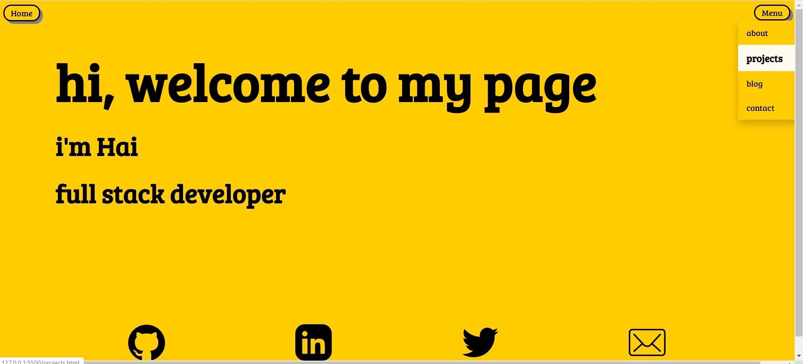

<h1> Hai Ho  Portfolio Website 

<h3>Website : 
<h3>Github : https://github.com/hai14894 

<h1> Purpose 
The portfolio website showcase my HTML and CSS skills that I've learned during my time at Coder Academy and beyond that. It's also how I implemented the designs I was inspired by to  my website. 

<h1>Functionality and Features

<h3>1.Navigation Bar
The site has navigation bar that include home button on the top left of the page that returns to homepage and a drop down menu located on the top right of the page that linked to about, projects, blog and contact page. 

<h3> Footer bar 
The footer stays on the bottom of the page, has the icon that link to my email, github, linkedin and twitter.
The icons expands when you hover over it.

<h3> Home page welcome text
The texts run from left to right in different animation, makes it looks very interactive.

<h3>Blog post page 
When you hover over the posts the colours will appear.

<h1>Accessibility

<h3> Alt-text has been added to the images for visually impaired individuals. The attention has been paid the the size and the font of the text, the contrast between the text and the background to make sure it's visible and fun to look at.

<h1>Website snapshot

<h1> Site map

<h1>Tech stack
<h3>HTML is used for the content of all webpages
<h3>CSS is used for the styling and positioning of elements.
<h3>Github is used for web-hosting.

